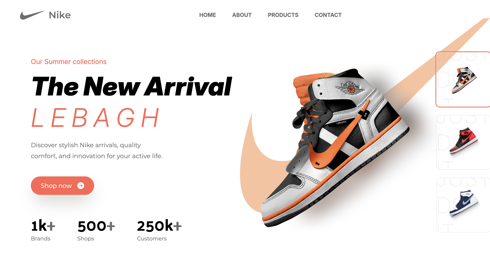
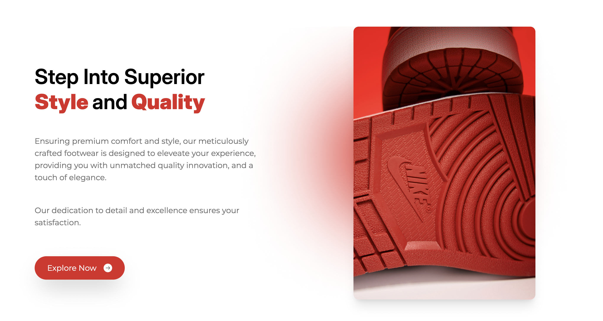
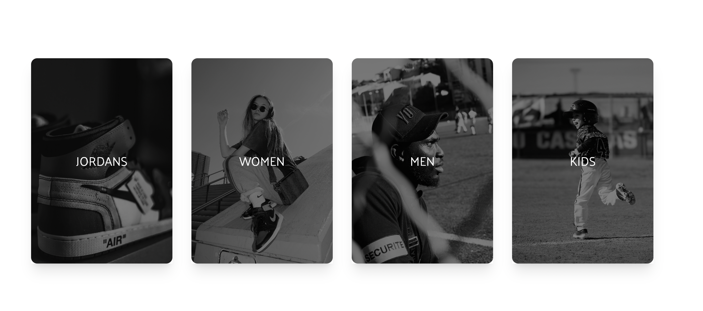

# A Mock Nike Website

**Nike** is a modern looking, simple site that is made for practice purposes only. It's functionality only lies with the practice of State Management, with a sprinkle of useEffect. As much as it was for practice purposes, it's a fun project that changes themes and contents depending the shoe clicked on the thumbnails.

---

## Table of Contents

- [Screenshots](#-screenshots)
- [Tech Stack](#️-tech-stack)
- [Getting Started](#️-getting-started)
  - [Prerequisites](#prerequisites)
  - [Installation & Setup](#installation--setup)
  - [Running the App](#running-the-app)

---

## Screenshots





## 🛠️ Tech Stack

- **Frontend:**
  - [HTML]
  - [JavaScript]
  - [React](https://reactjs.org/) (via Vite)
  - [Tailwind CSS](https://tailwindcss.com/) for styling
- **State Management:** React Hooks (`useState`, `useEffect`)

---

## ⚙️ Getting Started

Follow these instructions to get a local copy up and running for development purposes.

### Prerequisites

- [Node.js](https://nodejs.org/)
- [npm](https://www.npmjs.com/) or [yarn](https://yarnpkg.com/)

### Installation & Setup

1.  **Clone the repository:**
    ```bash
    git clone https://github.com/[pandeemiC]/[nikeReact].git
    cd [nikeReact]
    ```
2.  **Install dependencies:**
    ```bash
    npm install
    # or
    yarn install
    ```

### Running the App

- **Development Server:**

  ```bash
  npm run dev
  # or
  yarn dev
  ```

  This will usually start the app on `http://localhost:5173` (Vite's default).

- **Production Build:**
  ```bash
  npm run build
  # or
  yarn build
  ```
  This creates an optimized build in the `dist` folder.
